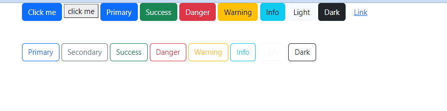

- few images were taken from https://getbootstrap.com

# shortcuts
- `link` -> to add links to sheet
    - `<link rel="stylesheet" href="">`
- `h1` -> will give the complete h1 tag
    -   `<h1></h1>`
- `.container` -> this will create a container
    - `<div class="container"></div>`
- `style` -> will give us the style tag
    - `<style></style>`
- `.row` -> will generate
    - `<div class="row"></div>`
- `.col*2` - will generate 2 columns
    - `<div class="col"></div>
            <div class="col"></div>`
- `img.card-img-top` - will generate
    - ``

# Grid layout

- the total page is divided into 12 units


   
- xs 12
- sm 6
- md 4
- lg 3
- xl 2
- xxl 1


- `<div class="container">content</div>`
    - this will create `content` in a container
- `<div class="container border">content</div>`
    - this will giver border to the container
- `<div class="container-fluid border">content</div>`
    - this will make the container occupy the whole screen.whereas the previous 2 will occupy leaving some space in right and left
- `<div class="container-md border">content</div>`
    - initially it will behave like a normal container without fluid.once the breakpoint is reached it will be fluidic

- `<div class="row">
            <div class="col-4">col1</div>
            <div class="col-4">col2</div>
            <div class="col">col2 auto</div>
        </div>`
    - this is for creating split into the row
    - here it is 4+4+x=12 
- if we want to split it as per our wish
    - 
    - ```<div class="row">
            <div class="col-2">col1</div>
            <div class="col-7">col2</div>
            <div class="col">col2 auto</div>
        </div>```
    - this will always be in the same size even after shrinking,like below
    
- if we want it responsive like
    - usual in big screen
    
    - occupy the whole screen while shrinking
    
- what is my-5?
    - 
    - example of container without my-5
    - there will be no space between containers
        - 
    - adding my-5
        like `<div class="container my-5">` will give 5px space between the two containers like this
        - 